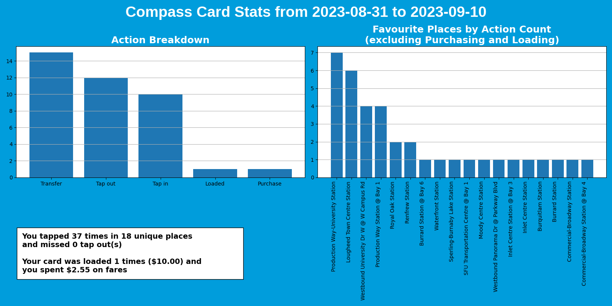
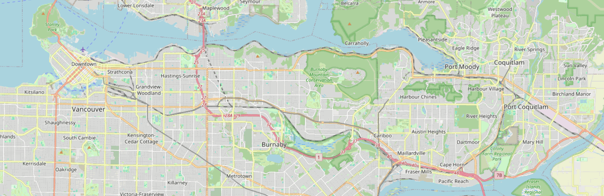

*See more example outputs in the [examples](examples) folder*

<h1>Compass Stats</h1>
This project uses the CSV export from the Compass Card website to gather statistics about your tap count, money spent, and favourite places visited. 

<h2>Generated Files</h2>

- A neat plot to show your fellow transit enthusiasts
- A spreadsheet-ready CSV file (with new fields vs the original CSV export) for your own stat crunching 
  - (new fields: iso-datetime, action, stop_id, stop_code, proper_name, lat, long)
- A .geojson file with the aforementioned enhanced attributes and ISO-formatted time, that can be plopped into your GIS software of choice to make temporal maps 

<h2>Installation</h2>

1. Get Python (3.10.11 or 3.12.2 are known to work) if necessary
   - (Optional) Create a Python virtual environment and activate it.
2. **Install Required Packages** with `pip install -r requirements.txt` 
3. **Get CSV Export** from <https://compasscard.ca>
   1. Login to your account (you registered your card right?)
   2. Go to a linked card and click **View Card Usage**
   3. Go to **Detailed View**, and click the dropdown under "Show:" to select your date range. "Custom Date Range" seems to work best, as Previous Year doesn't do what one might expect it to
   4. Click **Download CSV**, and place it (preferably) in the data folder 
4. Copy `config.yaml.default` and rename the copy to `config.yaml`
5. (Optional) Update (or downgrade) stops.txt in the "data" folder. The pre-included one may be out of date (or too up-to-date if you have old taps). 
   1. Download the static GTFS data from <https://www.translink.ca/about-us/doing-business-with-translink/app-developer-resources/gtfs/gtfs-data>
   2. Extract stops.txt from the resulting zip file
   3. Place stops.txt in the appropriate place

<h2>Configuration Fields</h2>

**hidden places**: An array of `stop_id` (the first field in the stops.txt file) that will be skipped during stat calculation, incase you frequent a certain stop. Bus exchanges have unique stop_id values for each bus bay, so make sure to hide all of them if you want to hide the entire bus exchange

<h4>file</h4>

Using absolute file paths (on Windows) appears to cause issues, try to use relative paths by putting your files in the `data` folder

- **csv:** An array of CSV files that will be processed every time the program is run. See `config.yaml.default` to see how these should be formatted
- **stops:** The location of the stops.txt file from Translink

**outputs:** Various outputs that the program will produce, all are enabled by default

**output_dir:** The directory to place saved files, if the outputs are enabled
